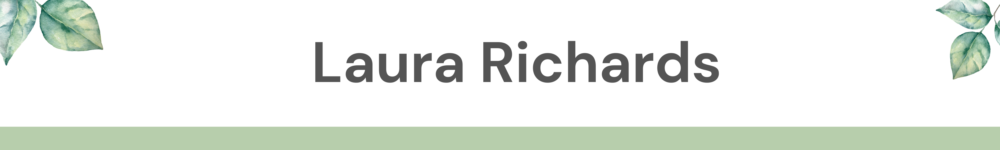

## Projects 
- [My foundations Blog:](https://www.laura-richards.github.io/) This was my first project which I created as part of the foundations course at Dev Academy. You can find the repo for this [here](https://github.com/laura-richards/laura-richards.github.io) 
- [What-can-we-eat](): This was my first solo fullstack CRUD app built using React and Typescript.
- [Earth-Mates](): This was built by myself, Opelo, Mark, Hope and Rich as part of our final projects for the Dev Academy Bootcamp.

## Skills 
### Tech
- Programming Languages:  JavaScript, TypeScript, Node.js, Express.js, React.js
- Web Development: HTML, CSS, React
- Databases: SQLite, Knex.js  
- Auth0 
- vite 
- Command line basics, GitFlow and GitHub

  &nbsp;
  &nbsp;
  &nbsp;
  &nbsp;
  &nbsp;
  &nbsp;
  
  

### Human 
- Communication: solid experience base in working with others in a variety of environments, leading groups, teaching and collaborating with others. 
- Problem-solving: ability to remain calm, think outside of the box and apply a variety of different techniques tech and other environments
- Organization and time management skills 
- Love of learning

## Contact 

- Email: laurarichardsnz@gmail.com
- LinkedIn: [linkedin.com/in/laura-richards-a54871225/](https://www.linkedin.com/in/laura-richards-a54871225/)

<!--
Here are some ideas to get you started:

- 🔭 I’m currently working on ...
- 🌱 I’m currently learning ...
- 👯 I’m looking to collaborate on ...
- 🤔 I’m looking for help with ...
- 💬 Ask me about ...
- 📫 How to reach me: ...
- 😄 Pronouns: ...
- ⚡ Fun fact: ...
-->
